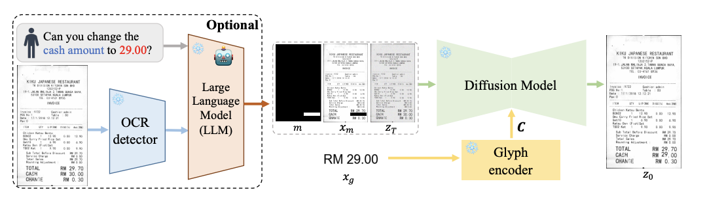
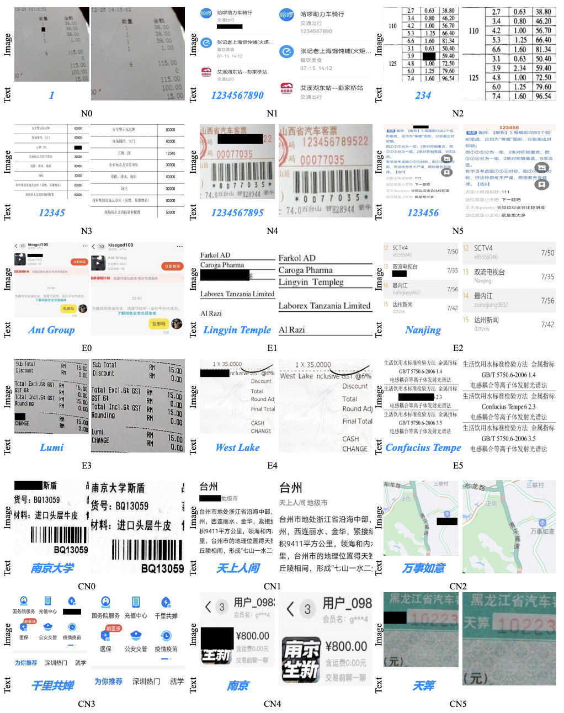

# DiffUTE
This repository is the code of our NeurIPS'23 paper "DiffUTE: Universal Text Editing Diffusion Model". Unfortunately, pre-trained models are not allowed to be made public due to the lisence of AntGroup. You can easily reproduce our method using [diffusers](https://github.com/huggingface/diffusers) and [transformers](https://github.com/huggingface/transformers).

## Getting Started with DiffUTE
### Installation
The codebases are built on top of [diffusers](https://github.com/huggingface/diffusers). Thanks very much.

#### Requirements
- Linux or macOS with Python ≥ 3.8
- PyTorch ≥ 1.10.0 and [torchvision](https://github.com/pytorch/vision/) that matches the PyTorch installation.
  You can install them together at [pytorch.org](https://pytorch.org) to make sure of this
- OpenCV
- transformers
#### Steps
1. Install diffusers following https://github.com/huggingface/diffusers.

2. Prepare datasets. Due to data sensitivity issues, our data will not be publicly available now, you can reproduce it on your own data, and all images with text are available for model training. Because our data is present on [Ali-Yun oss](https://www.aliyun.com/search?spm=5176.22772544.J_8058803260.37.4aa92ea9DAomsC&k=OSS&__is_mobile__=false&__is_spider__=false&__is_grey__=false), we have chosen pcache to read the data we have stored. You can change the data reading method according to the way you store the data.

3. Train VAE

4. Train DiffUTE


## Experimental results


## Citing DiffUTE

If you use DiffUTE in your research or wish to refer to the baseline results published here, please use the following BibTeX entry.

```BibTeX
@inproceedings{DiffUTE,
      title={DiffUTE: Universal Text Editing Diffusion Model},
      author={Chen, Haoxing and Xu, Zhuoer and Gu, Zhangxuan and Lan, Jun and Zheng, Xing and Li, Yaohui and Meng, Changhua and Zhu, Huijia and Wang, Weiqiang},
      booktitle={Thirty-seventh Conference on Neural Information Processing Systems (NeurIPS)},
      year={2023}
}
```

## Contacts
Please feel free to contact us if you have any problems.

Email: [hx.chen@hotmail.com](hx.chen@hotmail.com) or [zhuoerxu.xzr@antgroup.com](zhuoerxu.xzr@antgroup.com)
